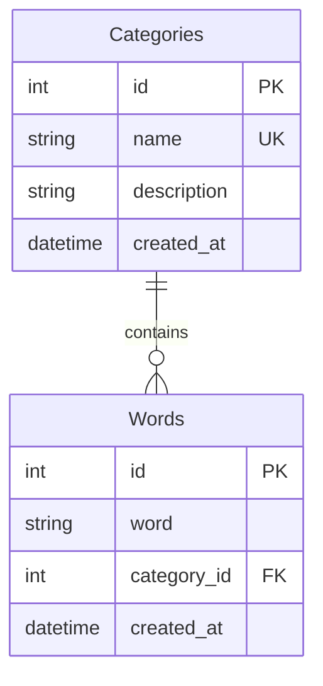

# Entity Relationship Diagram (ERD)

## Visual Diagram

```
┌─────────────────────────────┐              ┌──────────────────────────────┐
│       Categories            │              │           Words              │
├─────────────────────────────┤              ├──────────────────────────────┤
│ 🔑 id (PK)                  │              │ 🔑 id (PK)                   │
│ 📝 name (UNIQUE)            │◄─────────────│ 📝 word                      │
│ 📝 description              │   1    ∞     │ 🔗 category_id (FK)          │
│ 📅 created_at               │              │ 📅 created_at                │
└─────────────────────────────┘              └──────────────────────────────┘
     One Category                                  Many Words
```

## Relationship Type

**One-to-Many (1:∞)**
- One Category can have many Words
- Each Word belongs to exactly one Category

## Tables

### Categories Table

| Column      | Type     | Constraints           | Description                    |
|-------------|----------|-----------------------|--------------------------------|
| id          | INTEGER  | PRIMARY KEY, AUTO_INC | Unique identifier              |
| name        | TEXT     | NOT NULL, UNIQUE      | Category name (noun, verb, etc)|
| description | TEXT     | -                     | Human-readable description     |
| created_at  | DATETIME | DEFAULT CURRENT_TIME  | Record creation timestamp      |

**Sample Data:**
```sql
id | name       | description
---|------------|---------------------------
1  | noun       | Person, place, or thing
2  | verb       | Action or state of being
3  | adjective  | Describes a noun
4  | adverb     | Describes a verb or adjective
```

### Words Table

| Column      | Type     | Constraints           | Description                    |
|-------------|----------|-----------------------|--------------------------------|
| id          | INTEGER  | PRIMARY KEY, AUTO_INC | Unique identifier              |
| word        | TEXT     | NOT NULL              | The actual word                |
| category_id | INTEGER  | NOT NULL, FOREIGN KEY | References Categories(id)      |
| created_at  | DATETIME | DEFAULT CURRENT_TIME  | Record creation timestamp      |

**Foreign Key:**
```sql
FOREIGN KEY (category_id) REFERENCES Categories(id) ON DELETE CASCADE
```

**Sample Data:**
```sql
id | word      | category_id
---|-----------|------------
1  | cat       | 1  (noun)
2  | dog       | 1  (noun)
3  | run       | 2  (verb)
4  | jump      | 2  (verb)
5  | happy     | 3  (adjective)
6  | sad       | 3  (adjective)
7  | quickly   | 4  (adverb)
8  | slowly    | 4  (adverb)
```

## Indexes

For performance optimization:

```sql
CREATE INDEX idx_words_category ON Words(category_id);
CREATE INDEX idx_categories_name ON Categories(name);
```

- **idx_words_category**: Speeds up queries filtering words by category
- **idx_categories_name**: Speeds up category lookups by name

## Database Constraints

### Primary Keys
- Ensures each record has a unique identifier
- Auto-incrementing for easy insertion

### Foreign Key Constraint
- Maintains referential integrity
- `ON DELETE CASCADE`: If a category is deleted, all its words are also deleted

### Unique Constraint
- Category names must be unique (can't have two "noun" categories)

## Query Examples

### Get all nouns:
```sql
SELECT w.word 
FROM Words w
JOIN Categories c ON w.category_id = c.id
WHERE c.name = 'noun';
```

### Get word count per category:
```sql
SELECT c.name, COUNT(w.id) as word_count
FROM Categories c
LEFT JOIN Words w ON c.id = w.category_id
GROUP BY c.id, c.name;
```

### Get random word from each category:
```sql
SELECT c.name, w.word
FROM Categories c
JOIN Words w ON c.id = w.category_id
WHERE w.id IN (
    SELECT id FROM Words 
    WHERE category_id = c.id 
    ORDER BY RANDOM() 
    LIMIT 1
)
GROUP BY c.id;
```

## Mermaid Diagram

For tools that support Mermaid syntax:



## Design Decisions

### Why This Structure?

1. **Normalization**: Categories are stored once, referenced by many words
2. **Flexibility**: Easy to add new categories or words
3. **Performance**: Indexes on foreign keys for fast joins
4. **Data Integrity**: Foreign key constraints prevent orphaned words
5. **Scalability**: Can easily extend with additional attributes

### Future Enhancements

Possible extensions to this schema:

1. **User-submitted words**:
   ```sql
   ALTER TABLE Words ADD COLUMN user_id INTEGER;
   ALTER TABLE Words ADD COLUMN approved BOOLEAN DEFAULT FALSE;
   ```

2. **Word metadata**:
   ```sql
   ALTER TABLE Words ADD COLUMN difficulty_level INTEGER;
   ALTER TABLE Words ADD COLUMN usage_count INTEGER DEFAULT 0;
   ```

3. **Synonyms/Related words**:
   ```sql
   CREATE TABLE WordRelations (
       word_id_1 INTEGER,
       word_id_2 INTEGER,
       relation_type TEXT
   );
   ```

## Database Technology

**Cloudflare D1**
- SQLite-based database
- Edge-optimized for low latency
- Supports standard SQL operations
- Automatic backups and replication

---

**Created:** 2024-01-01  
**Last Updated:** 2026-05-06
